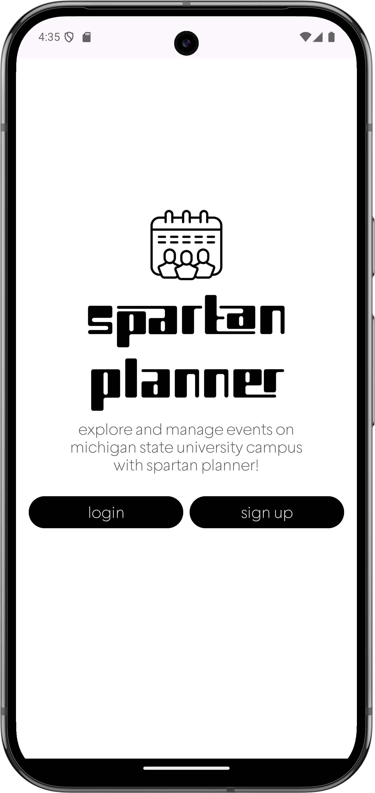
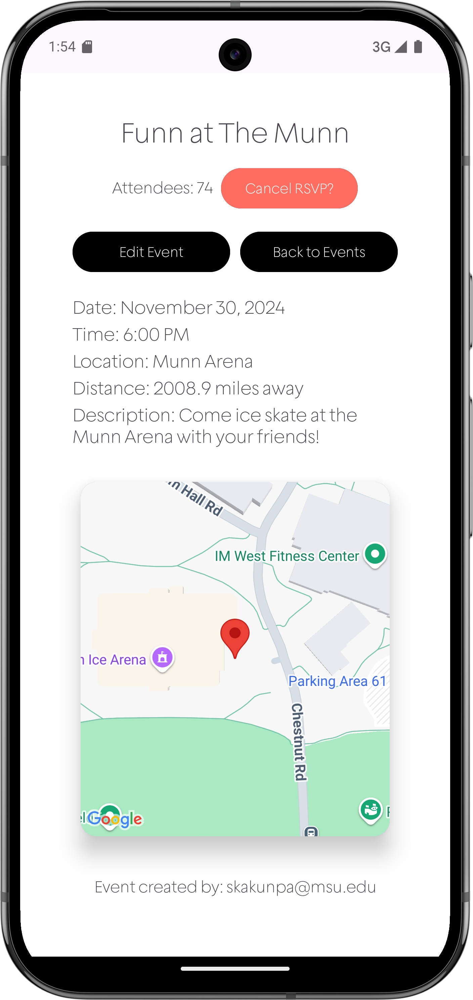
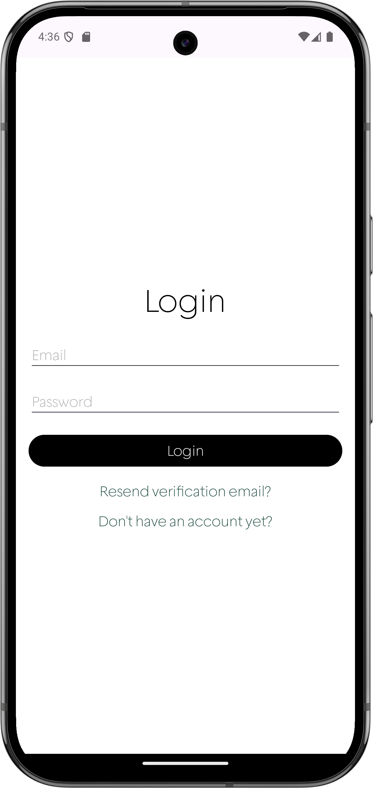
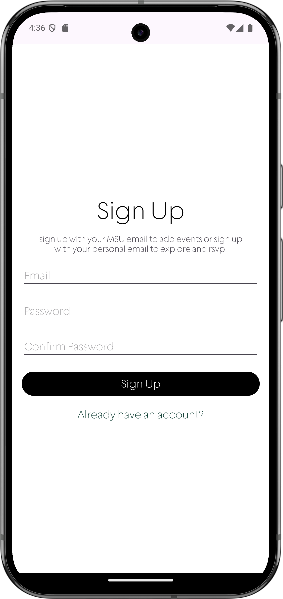
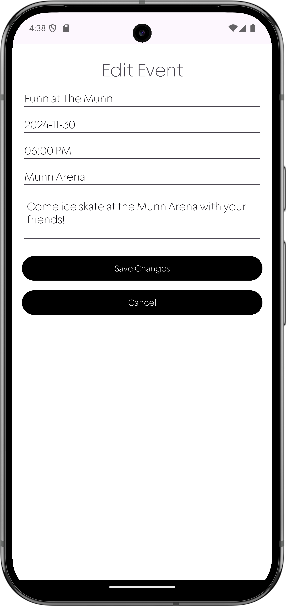
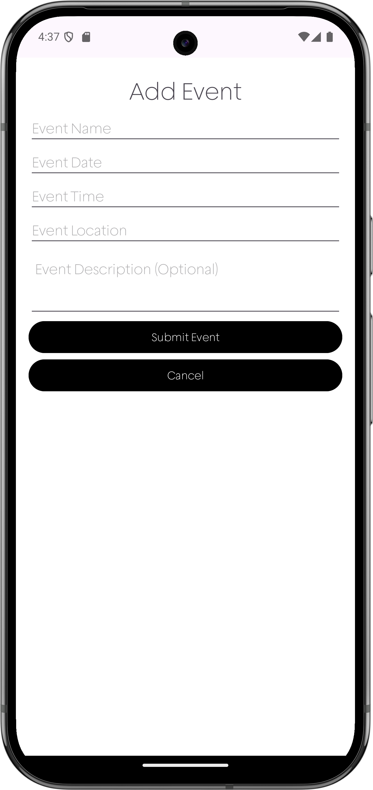
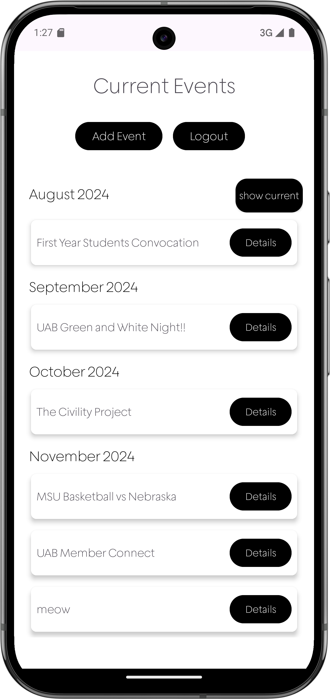

# 📅 Spartan Planner: Campus Event Scheduler
Soon available on Google Play!

## 🌟 **Overview**  
**Spartan Planner** is your ultimate tool to discover and register for campus events at MSU. Empowered by a crowdsourced event database, the app keeps students connected to the Spartan community. Whether you're RSVPing to events, saving them to your calendar, or sharing your own, Spartan Planner makes campus life simpler and more engaging.  

---

### **✨ Key Features**  
- 📍 **Discover Events**: Explore an extensive database of campus activities.  
- 🗓️ **Save & RSVP** (coming soon): Add events to your calendar and RSVP in-app.  
- ➕ **Share Events**: Contribute to the community by creating events.  
- 🔄 **Real-time Sync**: Seamlessly updates across devices using Firebase Firestore.  

---

## 🛠️ **Technologies**  

### **Data Sources and Sinks**  
- **App Data Source**:  
  - Inputs: User-submitted event details (name, date, location), login/signup forms.  
  - Lightweight, key-value pair structure for quick processing.  

- **Remote Data Sink**:  
  - **Firebase Firestore**:  
    - Secure, scalable storage of events and user data.  
    - Logs events and syncs across devices in real time.  

### **Local Data Storage**  
- **SharedPreferences**:  
  - Stores lightweight data like user login status (`isLoggedIn`).  
  - Optimizes performance by reducing dependency on remote checks.  

### **Remote Data Storage**  
- **Why Firebase Firestore?**  
  - NoSQL structure for flexibility and scalability.  
  - Real-time updates for dynamic event synchronization.  
  - Stores event details (name, date, location, coordinates) and user data.  

### **Client/Server Communication**  
- **Technologies Used**:  
  - Firebase Authentication for secure login.  
  - Firestore SDK for database interactions.  
- **Rationale**:  
  - Ensures secure, efficient authentication.  
  - Real-time updates for a seamless user experience.  

---

## 📸 **Screenshots**  
| **Home Screen**              | **Current Events**           | **Event Details**           | 
|-------------------------------|------------------------------|------------------------------|
|  |  |   |

| **Login**                | **Sign Up**                |  
|------------------------------|-----------------------------|  
|  |  |  

   | **Edit Event**       | **Add New Event**                | **Show Past Events**                |
|-------------------------------|------------------------------|------------------------------|
 | |  |  | 
---

## 📊 **System Architecture**  
### **Client-Server Integration**  

This diagram illustrates how the app communicates with Firebase to handle user authentication, store event data, and synchronize changes in real-time.  
---

## ✨ **Contributors**  
We’re proud of our collaborative effort to make campus life more connected.  

> For feedback or collaboration, feel free to reach out!  

--- 

🎉 **Stay Spartan Strong!**  
